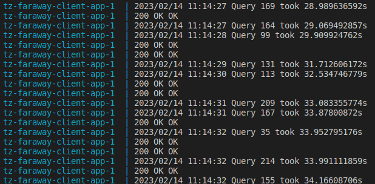

# Faraway TZ

## Map:
`/lib` - библиотека с защитой TCP-соединения от DDOS с помощью POW алгоритма <br>
`/server` - тестовый сервер для демонстрации работы с библиотекой <br>
`/client` - тестовый клиент для демонстрации работы с библиотекой <br>

На случай если непосредственно хочется протестировать работу в условиях DDOS атаки, есть ветка `test-ddos`, перейдите на неё и запустите сервер и клиент командами (цифры можно подкорректировать так как вы хотите)
```
make up
```

Пример проверки с ветки `test-ddos`


## Задача:

1) предлагаем тебе реализовать библиотеку (пакет), которая позволит добавить функциональность защиты от 
    DDOS с использованием POW для любого прикладного прикладного протокола, работающего поверх TCP.
2) в библиотеке должны быть реализованы функции/методы для оборачивания исходящего TCP соединения(клиент) и входящего TCP соединения(сервер). 
3) продемонстрировать работу библиотеки необходимо на примере HTTP сервера и клиента.
Это тестовое позволит тебе  закрепить разницу между TCP и HTTP 🙂
